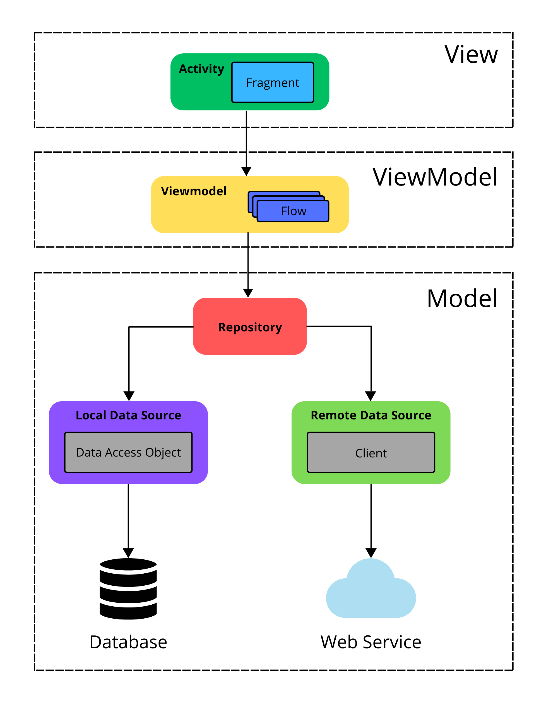

<h1 align="center" style="border-bottom: 0">&#x26A1; PokéCompanion &#x26A1;</h1>
<div align="center">Ultimate Pokemon Search App</div>

## Functionality Highlights:

- &#128269; Pokemon Search: Search and find your ideal Pokemon. Explore and discover the perfect companion for your journey.
- &#128640; Adventure Partner: Your chosen Pokemon becomes your trusted companion. Experience the journey together and witness potential evolutions.
- &#129516; Evolution Pact: Your Pokemon will evolve but with one condition - it must join you on your adventures!

> PokéCompanion is an Android native application made for demonstration purposes. It's a work in progress, and functionalities are subject to change.


## Tech stack:
- [Kotlin](https://github.com/JetBrains/kotlin) - Modern and concise programming language for Android development.
- [Coroutines + Flow](https://github.com/Kotlin/kotlinx.coroutines) - For asynchronous programming and handling data streams.
- [ViewBinding](https://developer.android.com/topic/libraries/view-binding) - Simplifies interaction with layout views by generating class containing direct references.
- [Lifecycle](https://developer.android.com/jetpack/androidx/releases/lifecycle) - Provides number of callbacks that inform activity or fragment about state changes.
- [Paging](https://developer.android.com/topic/libraries/architecture/paging/v3-overview) - Loads and displays pages of data from larger dataset that's stored either locally or remotly.
- [Room](https://developer.android.com/training/data-storage/room) - Provides database layer over SQLite database engine, simplifying data access.
- [ViewModel](https://developer.android.com/topic/libraries/architecture/viewmodel) - Simplifies holding and managing UI-related data.
- [Retrofit2](https://github.com/square/retrofit) + [OkHttp3](https://github.com/square/okhttp) - Provides type-safe HTTP REST client.
- [Hilt](https://developer.android.com/training/dependency-injection/hilt-android) - Reduces boilerplate code by simplifying dependency injection process.
- [Glide](https://github.com/bumptech/glide) - Loads and caches images from network.
- [Gradle](https://github.com/gradle/gradle) - Manages dependencies and automates the build process.
- [ksp](https://github.com/google/ksp) -  Kotlin symbol processing API.


## Architecture:
<p align="center">
    
</p>
PokeCompanion is based on Model-View-ViewModel architecture pattern and Repository pattern.

### Model
Embodies the core data and business logic of the Android app. This includes managing how data is fetched locally or from remote sources, defining the structure of data using model classes, and handling data interactions through a repository.

### View
Encompasses the user interface (UI) elements, such as activities or fragments, as well as their XML layouts. The View triggers user actions and communicates with the ViewModel but doesn't directly receive responses. Instead, it subscribes to observables exposed by the ViewModel to receive updates.

### ViewModel
Serves as a mediator between the View and the Model, the ViewModel shields itself from direct knowledge of which View is utilizing it. Its primary role is to interact with the Model and expose observables that the View can observe for updates. This separation allows the ViewModel to handle data operations independently, without needing awareness of the specific View it's serving.

# License
```xml
Designed and developed by 2024 gufeczek (Michał Goluch)

Licensed under the Apache License, Version 2.0 (the "License");
you may not use this file except in compliance with the License.
You may obtain a copy of the License at

   http://www.apache.org/licenses/LICENSE-2.0

Unless required by applicable law or agreed to in writing, software
distributed under the License is distributed on an "AS IS" BASIS,
WITHOUT WARRANTIES OR CONDITIONS OF ANY KIND, either express or implied.
See the License for the specific language governing permissions and
limitations under the License.
```

